## APACHE SPARK

<a name="readme-top"></a>

<!-- TABLE OF CONTENTS -->
<details>
  <summary>Daftar Isi</summary>
  <ol>
    <li>
      <a href="#memulai-spark">Memulai Spark</a>
      <ul>
        <li><a href="#akses-ke-folder-spark">Akses Ke Folder Spark</a></li>
        <li><a href="#tampilkan-di-browser">Tampilkan di Browser</a></li>
      </ul>
    </li>
    <li>
      <a href="#memulai-spark-shell">Memulai Spark Shell</a>
      <ul>
        <li><a href="#menjalankan-spark-shell">Menjalankan Spark Shell</a></li>
        <li><a href="#menjalankan-kode-scala">Menjalankan Kode Scala</a></li>
        <li><a href="#tampil-kode-scala">Tampil Kode Scala</a></li>
        <li><a href="#mode-paste-secara-multi-line">Mode Paste Secara Multi-Line</a></li>
        <li><a href="#menjalankan-kode-program-akan-tampil">Menjalankan kode program Akan Tampil</a></li>
        <li><a href="#penjelasan-kode-program-yang-error">Penjelasan Kode Program Yang Error</a></li>
      </ul>
    </li>
    <li>
      <a href="#memulai-pyspark">Memulai PySpark</a>
      <ul>
        <li><a href="#menjalankan-pyspark">Menjalankan PySpark</a></li>
        <li><a href="#tampil-menjalankan-pyspark">Tampil Menjalankan PySpark</a></li>
        <li><a href="#kode-1">Kode 1</a></li>
        <li><a href="#akses-spark-ui">Akses Spark UI</a></li>
      </ul>
    </li>
    <li>
      <a href="#praktikum-1">Praktikum 1</a>
      <ul>
        <li><a href="#kode-2">Kode 2</a></li>
        <li><a href="#kode-3">Kode 3</a></li>
        <li><a href="#kode-4">Kode 4</a></li>
        <li><a href="#kode-5">Kode 5</a></li>
        <li><a href="#kode-6">Kode 6</a></li>
      </ul>
    </li>
    <li>
      <a href="#praktikum-2">Praktikum 2</a>
      <ul>
        <li><a href="#praktikum-kode-1">Praktikum Kode 1</a></li>
        <li><a href="#praktikum-kode-2">Praktikum Kode 2</a></li>
        <li><a href="#praktikum-kode-3">Praktikum Kode 3</a></li>
        <li><a href="#praktikum-kode-4">Praktikum Kode 4</a></li>
        <li><a href="#praktikum-kode-5">Praktikum Kode 5</a></li>
        <li><a href="#praktikum-kode-6">Praktikum Kode 6</a></li>
      </ul>
    </li>
  </ol>
</details>


<!-- Memulai Spark -->
# Memulai Spark
## Akses Ke Folder Spark
  ```sh
  cd /home/cloudera/spark-2.0.0-bin-hadoop2.7/sbin
  sudo ./start-all.sh
  ```
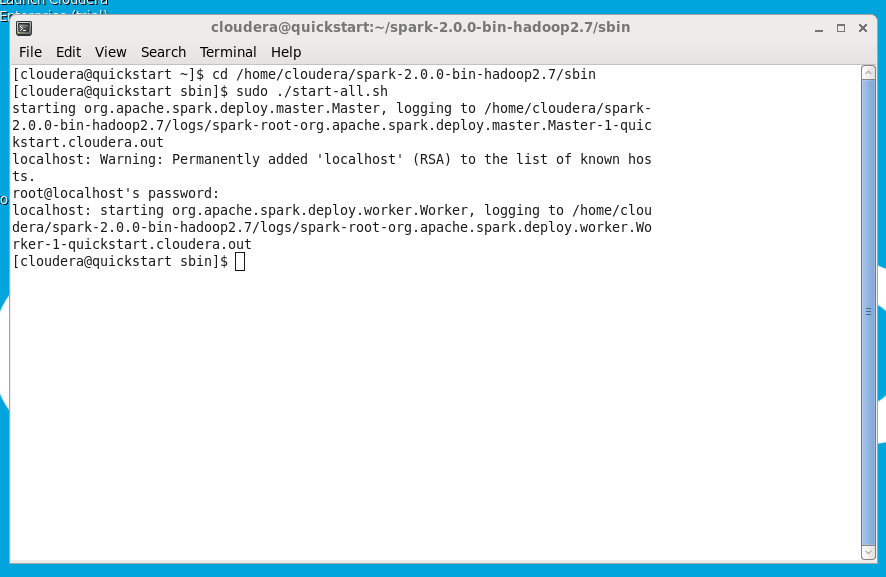

## Tampilkan di Browser
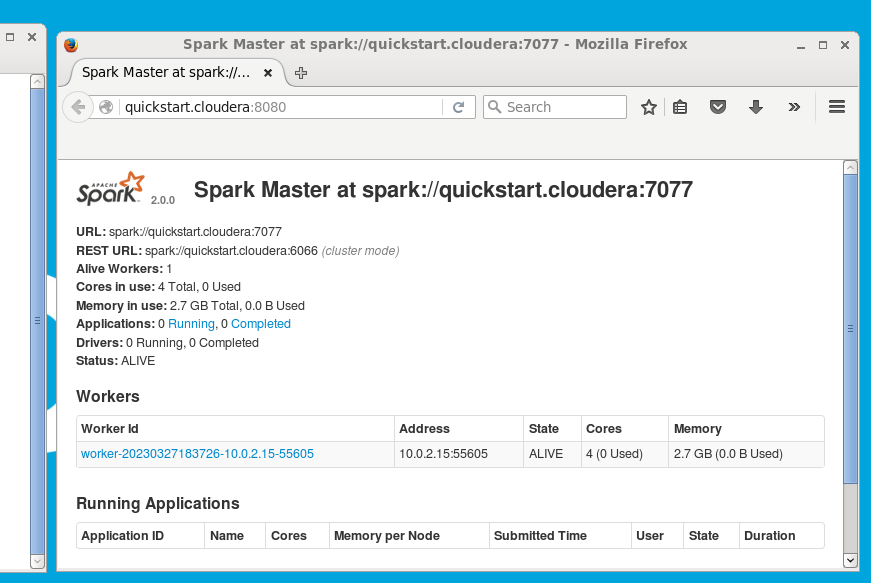

<p align="right">(<a href="#readme-top">back to top</a>)</p>


<!-- Memulai Spark Shell-->
# Memulai Spark Shell
## Menjalankan Spark Shell
  ```sh
  spark-shell
  ```


## Menjalankan Kode Scala
   ```sh
   import sys.process._
   val res = "ls /tmp" !
   println(res)
   ```

## Tampil Kode Scala
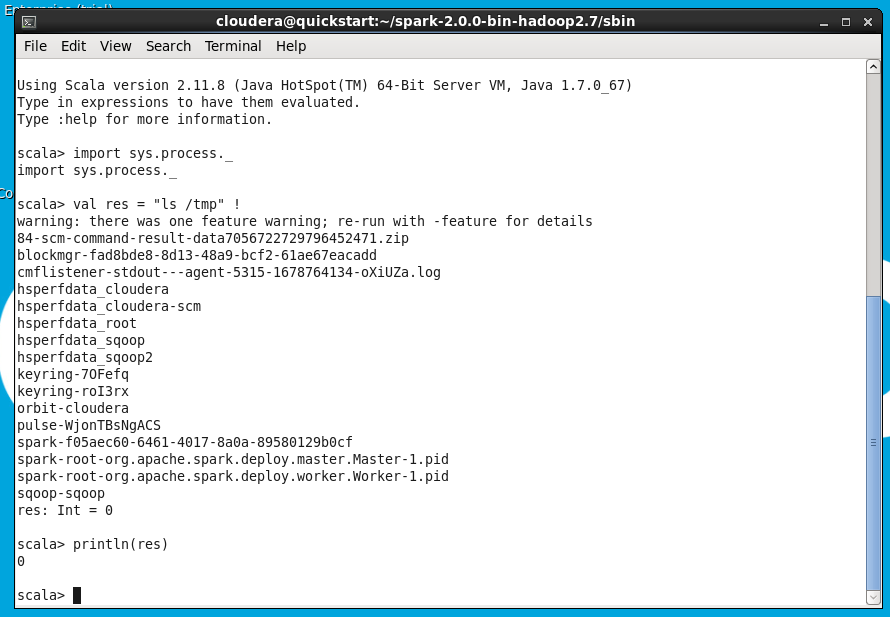

## Mode Paste Secara Multi-Line
   ```sh
   :paste
   ```

## Menjalankan kode program Akan Tampil


## Penjelasan Kode Program Yang Error


<p align="right">(<a href="#readme-top">back to top</a>)</p>


<!-- Memulai PySpark -->
# Memulai PySpark
## Menjalankan PySpark
  ```sh
  pyspark
  ```

## Tampil Menjalankan PySpark
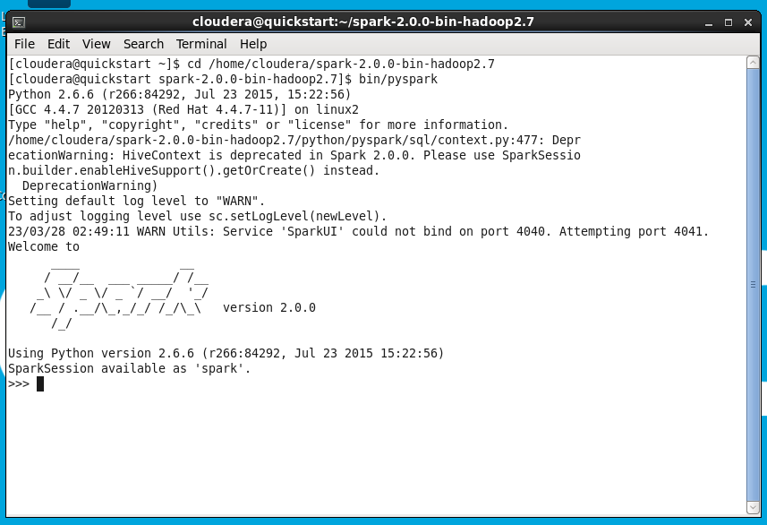

## Kode 1
  * Code
  ```sh
  myaccum = sc.accumulator(0)
  myrdd = sc.parallelize(range(1,100))
  myrdd.foreach(lambda value: myaccum.add(value))
  print myaccum.value
  ```
  ## HASILNYA : 
  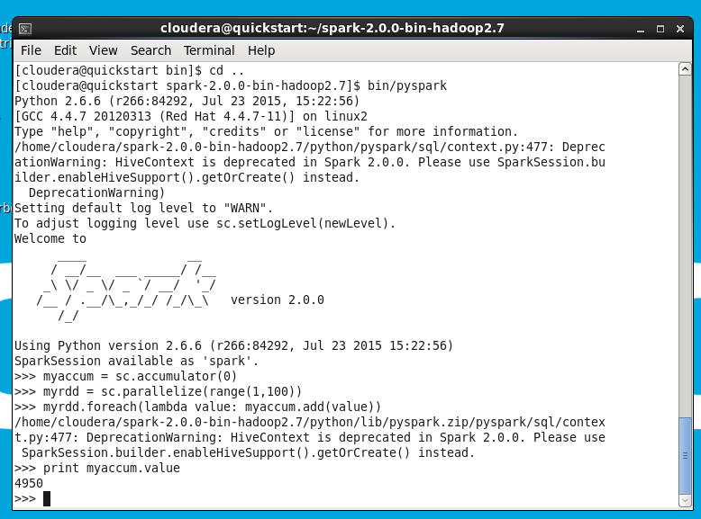

## Akses Spark UI

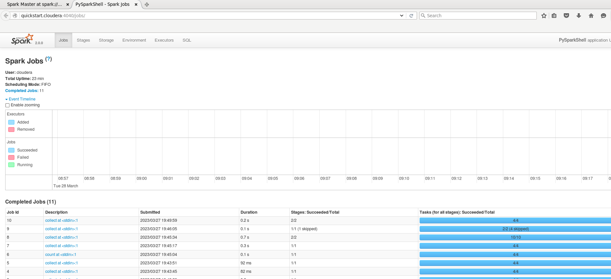

<p align="right">(<a href="#readme-top">back to top</a>)</p>


<!-- Praktikum 1 -->
# Praktikum 1
## Kode 2
* Code
  ```sh
  broadcastVar = sc.broadcast(list(range(1, 100)))
  broadcastVar.value
  ```
  ## HASILNYA : 
  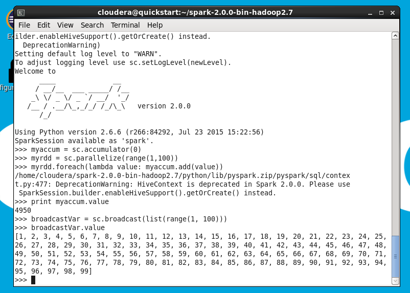

## Kode 3
   - Silakan ganti sesuai letak file txt Anda yang dapat berisi teks apapun untuk diproses.
   - Kata yang di Filter "Spark"
  * Code
  ```sh
  # Get the lines from the textfile, create 4 partitions
  access_log = sc.textFile("path/folder/anda", 4)

  #Filter Lines with ERROR only
  error_log = access_log.filter(lambda x: "ERROR" in x)

  # Cache error log in memory
  cached_log = error_log.cache()

  # Now perform an action -  count
  print "Total number of error records are %s" % (cached_log.count())

  # Now find the number of lines with 
  print "Number of product pages visited that have Errors is %s" % (cached_log.filter(lambda x: "product" in x).count())
  ```
  ## HASILNYA : 
  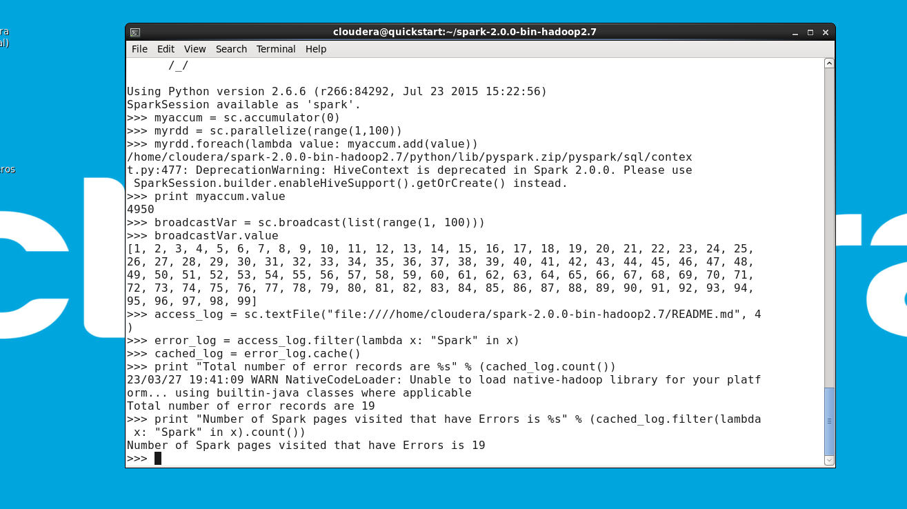
  
  ## Kode 4
  * Code
  ```sh
  mylist = ["my", "pair", "rdd"]
  myRDD = sc.parallelize(mylist)
  myPairRDD = myRDD.map(lambda s: (s, len(s)))
  myPairRDD.collect()
  myPairRDD.keys().collect()
  myPairRDD.values().collect()
  ```
  ## HASILNYA : 
  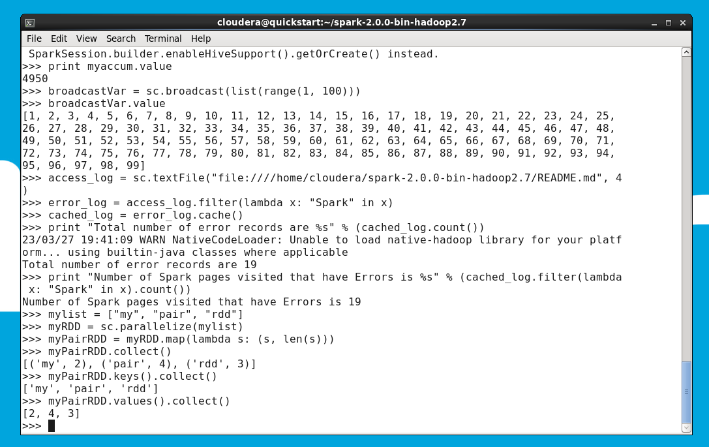
  
  ## Kode 5
  * Code
  ```sh
  # Check Default Parallelism
  sc.defaultParallelism

  #Let's create a list, parallelize it and let's check the number of partitions. 
  myList = ["big", "data", "analytics", "hadoop" , "spark"]
  myRDD = sc.parallelize(myList)
  myRDD.getNumPartitions()
  
  #To override the default parallelism, provide specific number of partitions needed while creating the RDD. In this case let's create the RDD with 6 partitions.
  myRDDWithMorePartitions = sc.parallelize(myList,6)
  myRDDWithMorePartitions.getNumPartitions()
 
  #Let's issue an action to count the number of elements in the list.
  myRDD.count()

  #Display the data in each partition
  myRDD.mapPartitionsWithIndex(lambda index,iterator: ((index, list(iterator)),)).collect()

  #Increase number of partitions and display contents
  mySixPartitionsRDD = myRDD.repartition(6)
  mySixPartitionsRDD.mapPartitionsWithIndex(lambda index,iterator: ((index, list(iterator)),)).collect()

  #Decrease number of partitions and display contents
  myTwoPartitionsRDD = mySixPartitionsRDD.coalesce(2)
  myTwoPartitionsRDD.mapPartitionsWithIndex(lambda index,iterator: ((index, list(iterator)),)).collect()

  # Check Lineage Graph
  print myTwoPartitionsRDD.toDebugString()
  ```
  
  ## HASILNYA : 
  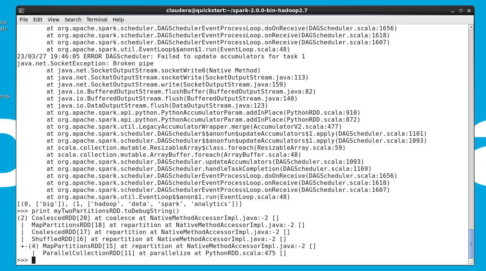
  
  ## Kode 6
  * Code
  ```sh
  from operator import add
  lines = sc.textFile("/path/to/README.md")
  counts = lines.flatMap(lambda x: x.split(' ')) \
                .map(lambda x: (x, 1)) \
                .reduceByKey(add)
  output = counts.collect()
  for (word, count) in output:
      print("%s: %i" % (word, count))
  ```
  ## HASIL 1: 
  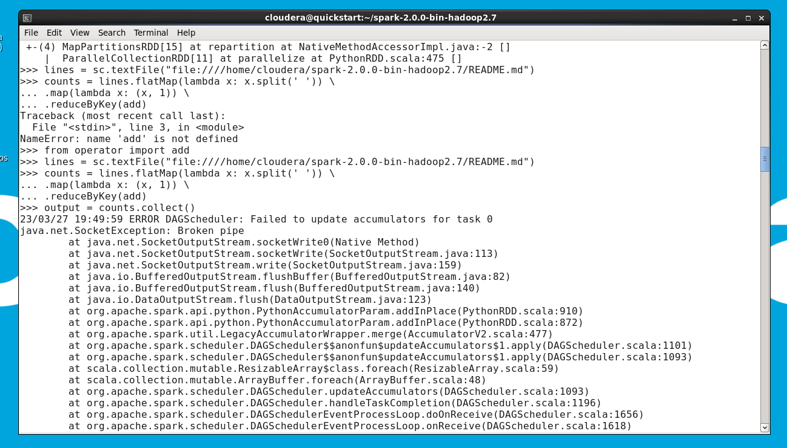
  
  ## HASIL 2: 
  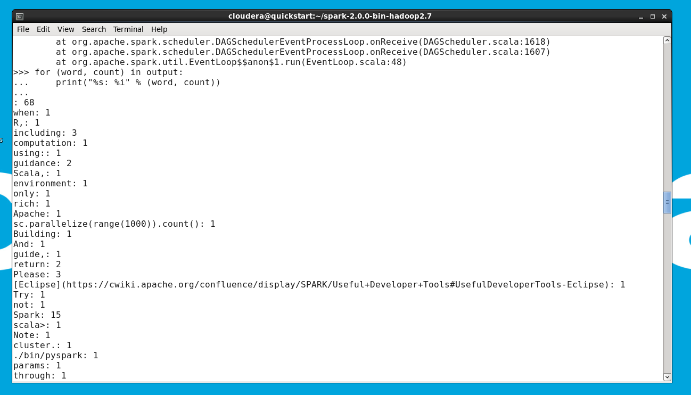
  

<p align="right">(<a href="#readme-top">back to top</a>)</p>


<!-- Praktikum 2 -->
# Praktikum 2
## Praktikum Kode 1
   - sc <br>
     Penjelasan :
     ```sh
     objek SparkContext yang digunakan untuk menghubungkan kode Python dengan mesin Spark.
     ```
     
   - accumulator <br>
     Penjelasan :
     ```sh
     fitur di Apache Spark yang digunakan untuk mengumpulkan nilai-nilai dari 
     setiap worker node yang menjalankan sebuah operasi tertentu pada sebuah RDD.
     ```
     
   - parallelize <br>
     Penjelasan :
     ```sh
     method pada objek SparkContext yang digunakan untuk membuat sebuah RDD 
     dari data yang sudah ada pada driver program.
     ```
     
   - lambda <br>
     Penjelasan :
     ```sh
     fitur di Python yang digunakan untuk membuat sebuah fungsi tanpa harus 
     menentukan nama fungsi secara eksplisit.
     ```
     
   - value <br>
     Penjelasan :
     ```sh
     method pada objek Accumulator yang digunakan untuk mengambil nilai akhir dari 
     sebuah accumulator setelah diisi dengan nilai-nilai dari RDD.
     ```
     

## Praktikum Kode 2
   - broadcast <br>
     Penjelasan :
     ```sh
     untuk mengirim variabel yang tidak berubah (immutable) ke setiap worker node hanya sekali, 
     sehingga menghemat penggunaan memori dan waktu komputasi.
     ```
     
   - list <br>
     Penjelasan :
     ```sh
     tipe data di Python yang digunakan untuk menyimpan kumpulan data dalam satu variabel.
     ```
     
   - range <br>
     Penjelasan :
     ```sh
     fungsi bawaan di Python yang digunakan untuk membuat urutan bilangan bulat 
     dengan parameter awal, akhir, dan increment.
     ```
     
## Praktikum Kode 3
   - textFile <br>
     Penjelasan :
     ```sh
     untuk membaca file teks dan mengubahnya menjadi RDD (Resilient Distributed Dataset) di Spark.
     ```
     
   - filter <br>
     Penjelasan :
     ```sh
     untuk menyaring elemen RDD dengan kriteria tertentu dengan menggunakan sebuah fungsi lambda.
     ```
     
   - cache <br>
     Penjelasan :
     ```sh
     untuk menyimpan RDD di memori, sehingga RDD tersebut bisa digunakan 
     kembali tanpa harus dibaca ulang dari sumbernya.
     ```
     
   - count <br>
     Penjelasan :
     ```sh
     untuk menghitung jumlah elemen dalam RDD. Fungsi ini merupakan tipe action di Spark, 
     yang mengakibatkan Spark menjalankan komputasi dan mengembalikan hasil ke driver program.
     ```
     
## Praktikum Kode 4
   - map <br>
     Penjelasan :
     ```sh
     operasi yang diterapkan pada RDD, yang mengubah setiap elemen RDD menjadi 
     elemen baru dengan mengikuti suatu fungsi tertentu.
     ```
     
   - collect <br>
     Penjelasan :
     ```sh
     operasi yang mengembalikan seluruh elemen dari RDD ke driver program sebagai array atau list.
     ```
     
   - len <br>
     Penjelasan :
     ```sh
     fungsi yang mengembalikan jumlah karakter dalam sebuah string.
     ```
     
   - keys <br>
     Penjelasan :
     ```sh
     operasi yang mengembalikan kumpulan kunci dari setiap pasangan kunci-nilai dalam Pair RDD.
     ```
     
   - values <br>
     Penjelasan :
     ```sh
     operasi yang mengembalikan kumpulan nilai dari setiap pasangan kunci-nilai dalam Pair RDD.
     ```
     
## Praktikum Kode 5
   - defaultParallelism <br>
     Penjelasan :
     ```sh
     variabel yang mengembalikan jumlah default dari partisi RDD yang dibuat di SparkContext.
     ```
     
   - getNumPartitions <br>
     Penjelasan :
     ```sh
     method yang digunakan untuk mengembalikan jumlah partisi dari RDD.
     ```
     
   - mapPartitionsWithIndex <br>
     Penjelasan :
     ```sh
     method yang mengembalikan RDD baru dengan menerapkan fungsi pada setiap partisi, 
     dengan mempertahankan indeks partisi.
     ```
     
   - repartition <br>
     Penjelasan :
     ```sh
     method yang digunakan untuk menyeimbangkan kembali data pada RDD dengan mengubah jumlah partisi.
     ```
     
   - coalesce <br>
     Penjelasan :
     ```sh
     method yang digunakan untuk mengurangi jumlah partisi RDD dengan menggabungkan partisi 
     yang saling berdekatan menjadi satu.
     ```
     
   - toDebugString <br>
     Penjelasan :
     ```sh
     method yang digunakan untuk mengembalikan deskripsi teks dari RDD, 
     termasuk informasi tentang partisi, ketergantungan, dan transformasi yang dijalankan pada RDD.
     ```
     
     
## Praktikum Kode 6
   - flatMap <br>
     Penjelasan :
     ```sh
     sebuah operasi pada RDD di Spark yang bertujuan untuk mengekspansi baris RDD dengan memisahkan setiap baris 
     menjadi kata-kata terpisah berdasarkan separator yang ditentukan, sehingga setiap kata yang diperoleh kemudian 
     akan dijadikan elemen yang berbeda-beda pada RDD baru. Pada kode di atas, operasi flatMap digunakan untuk 
     memisahkan setiap baris dalam RDD lines menjadi kata-kata terpisah dengan separator spasi (' ').
     ```
     
   - reduceByKey <br>
     Penjelasan :
     ```sh
     merupakan sebuah operasi pada RDD di Spark yang bertujuan untuk mengelompokkan pasangan kunci-nilai 
     berdasarkan kunci, dan kemudian menjumlahkan nilai-nilai yang sesuai dengan kunci yang sama. Dalam kode di atas, 
     operasi reduceByKey digunakan untuk menjumlahkan nilai 1 yang dihasilkan oleh operasi map pada setiap kunci kata yang sama, 
     sehingga menghasilkan jumlah kemunculan kata tersebut pada RDD yang dihasilkan.
     ```
     
   - split <br>
     Penjelasan :
     ```sh
     merupakan sebuah fungsi bawaan Python yang digunakan untuk memisahkan sebuah string menjadi beberapa bagian, 
     berdasarkan separator yang ditentukan. Pada kode diatas, fungsi split digunakan untuk memisahkan setiap baris 
     RDD lines menjadi kata-kata terpisah dengan separator spasi (' '), sehingga setiap kata tersebut kemudian 
     dijadikan elemen pada RDD baru setelah dilakukan operasi flatMap.
     ```
     
     
     
<p align="right">(<a href="#readme-top">back to top</a>)</p>


<!-- LICENSE -->
## License

See the LICENSE file for license rights and limitations (MIT).

<p align="right">(<a href="#readme-top">back to top</a>)</p>

